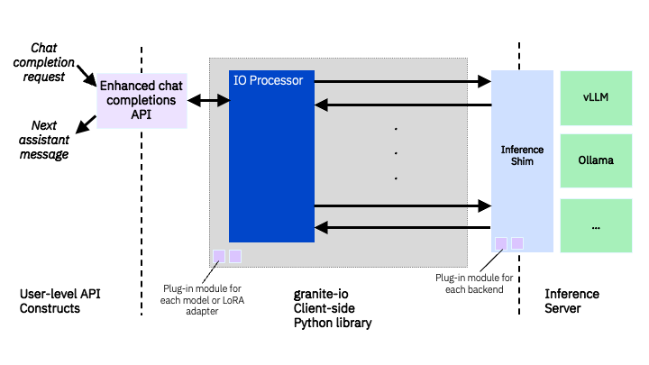

# Granite IO Processing: Architecture & Design

## What is Granite IO Processing?

Granite IO Processing is a Python framework that makes it easy to interact with IBM Granite models. It helps you:

- **Send questions or tasks to a model** (like a chatbot or document search)
- **Get back answers in a format you want**
- **Add extra features** (like citations, reasoning, or function calling) with minimal effort

Think of it as a toolkit that sits between you and the AI model, making your life easier whether you're building a chatbot, a document search tool, or something more advanced.

---

## Why Use This Framework?

IBM Granite models are powerful, but using all their features (like RAG, reasoning, or function calling) can be tricky. 

You might need to:

- Write complex prompts
- Parse messy outputs
- Switch between different backends (OpenAI, LiteLLM, Transformers, etc.)

**Granite IO Processing** solves these problems by giving you plug-and-play building blocks. 

You can:

- Turn on features with a flag (e.g., `thinking=True` for reasoning)
- Swap out how you talk to the model (the backend)
- Customize how you prepare inputs and process outputs

---

## The Big Picture: How It All Fits Together

Here's a simple analogy:

- **Backend**: The delivery truck that takes your request to the model and brings back the answer.
- **Input Processor**: The translator who turns your request into the model's language.
- **Output Processor**: The interpreter who turns the model's answer into something you can use.
- **IO Processor**: The project manager who coordinates the translator, interpreter, and delivery truck.

### Visual Overview


- You (the user) send a request.
- The **Input Processor** formats it for the model.
- The **Backend** delivers it to the model and gets the response.
- The **Output Processor** makes the response easy to use.

The system is flexible: you can use just the input or output processor, or both, or even swap in your own custom logic.

---

## Key Components Explained

### 1. Backend
- **What it does:** Connects to the actual model (could be OpenAI, LiteLLM, Transformers, etc.).
- **Why it matters:** Lets you switch between different model providers without changing your code.
- **Example:** Want to use a local model for testing and a cloud model in production? Just change the backend.

### 2. Input Processor
- **What it does:** Turns your structured request (like a list of chat messages) into the exact prompt the model expects.
- **Why it matters:** Different models (and features) need different prompt formats. The input processor handles this for you.
- **Example:** If you want the model to show its reasoning, the input processor adds the right instructions to your prompt.

### 3. Output Processor
- **What it does:** Takes the model's raw output and extracts the information you care about (like the answer, citations, or reasoning steps).
- **Why it matters:** Model outputs can be messy or inconsistent. The output processor gives you clean, structured results.
- **Example:** If you ask for citations, the output processor finds and returns them in a list.

### 4. IO Processor
- **What it does:** Combines the input processor, output processor, and backend into a single, easy-to-use interface.
- **Why it matters:** Most users just want to call one function and get results. The IO processor makes this possible.
- **Example:** `io_processor.create_chat_completion(...)` handles everything for you.

---

## How Do I Use or Extend This?

- **Default processors and backends** are provided for common use cases (Granite 3.2, OpenAI, LiteLLM, etc.).
- **You can create your own** by subclassing the provided interfaces (see the [API Reference](api.md)).
- **Mix and match**: Use a custom input processor with a default output processor, or vice versa.

### Example: Custom Input Processor (Pseudocode)
```python
from granite_io.io.base import InputProcessor
class MyInputProcessor(InputProcessor):
    def transform(self, inputs, add_generation_prompt=True):
        # Custom logic here
        return my_prompt_string
```

---

## Supported Out-of-the-Box

| Component      | What it is for         | Where to find it |
|---------------|------------------------|------------------|
| Granite 3.2   | Standard input/output  | [Input](https://github.com/ibm-granite/granite-io/blob/main/src/granite_io/io/granite_3_2/input_processors/granite_3_2_input_processor.py), [Output](https://github.com/ibm-granite/granite-io/blob/main/src/granite_io/io/granite_3_2/output_processors/granite_3_2_output_processor.py) |
| OpenAI        | Backend                | [OpenAI Backend](https://github.com/ibm-granite/granite-io/blob/main/src/granite_io/backend/openai.py) |
| LiteLLM       | Backend                | [LiteLLM Backend](https://github.com/ibm-granite/granite-io/blob/main/src/granite_io/backend/litellm.py) |
| Transformers  | Backend                | [Transformers Backend](https://github.com/ibm-granite/granite-io/blob/main/src/granite_io/backend/transformers.py) |

---

## Diagrams for Different Scenarios

### 1. All-in-One (IO Processor)


### 2. Custom Multi-Turn or Advanced Use


### 3. Using Only Input or Output Processor


---

## How Do I Make It My Own?

- **Want to add a new feature?** Create a new processor by subclassing the base classes.
- **Want to use a new backend?** Implement the backend interface and register it.
- **Want to parse outputs differently?** Write your own output processor.

See the [examples](https://github.com/ibm-granite/granite-io/tree/main/examples) directory for real code you can copy and adapt.